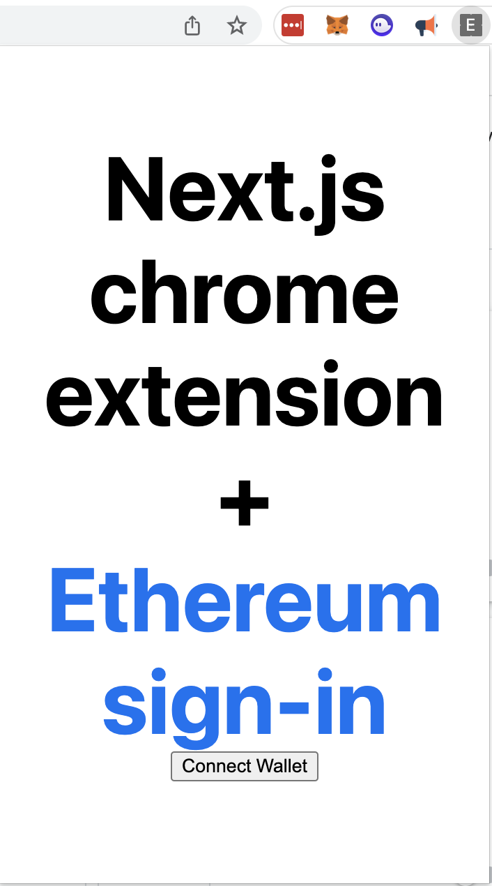

# siwe-chrome-extension

Ethereum Sign-In with Next.js Chrome Extension & Backend verify - ReadMe
=====================================================

This ReadMe provides instructions on how to use a Next.js Chrome extension to sign in with Ethereum and then verifies the signature for use on server-side tasks.

Overview
--------

The Next.js Chrome extension provides a secure and easy way to sign in with Ethereum on web applications. It allows users to authenticate their identity without the need for a traditional username and password. Instead, users can sign in using their Ethereum wallet via metamask. This could be extended to utilise web3Auth or Magic.Link which assigns a social login a wallet using MPC self-custody but for a user simplifies the experience similar to passwordless login.

Requirements
------------

To use this Chrome extension, you will need:

-   A computer with Google Chrome installed
-   NodeJs installed v16.17+
-   An Ethereum wallet with a compatible browser extension installed (e.g., MetaMask)
-   Metamask chrome extension installed

Installation
------------

To install the Next.js Chrome extension, follow these steps:

1.  Clone the Next.js Chrome extension repository:

bashCopy code

`git clone https://github.com/jospehdempsey/siwe-chrome-extension.git`

2.  Go to next-app folder & Install the required dependencies:

Copy code

`cd next-app & yarn`

3.  Build the extension:

Copy code

`yarn run build`

4.  Open Google Chrome and navigate to `chrome://extensions`.

5.  Enable developer mode by toggling the switch in the top right corner.

6.  Click the "Load unpacked" button and select the `extension` folder from the repository you cloned in step 1.

7.  The Next.js Chrome extension should now be installed and ready to use.
   
8.  Go to backend folder, install & run.

Copy code

`cd ../backend & npm run install & npm run start`

Usage
-----

To use the Next.js Chrome extension to sign in with Ethereum on a web application, follow these steps:

1.  Click the Next.js Chrome extension icon in the top right corner of your browser.

2.  click "Sign In", Metamask prompt will appear.

3.  If prompted, sign in via your Ethereum wallet extension.

4.  You should now be signed in to the web application.

Conclusion
----------

The Next.js Chrome extension provides a secure and easy way to sign in with Ethereum on web applications. By following the installation and usage instructions outlined in this ReadMe, you can easily set up and use the extension to authenticate your identity without the need for a traditional username and password.

Thanks to
----------
This starter builds upon these other starters
- https://github.com/thomaswang/next-chrome
- https://github.com/shaheem-khanzada/chrome-extension-react-metamask-boilerplate
- siwe